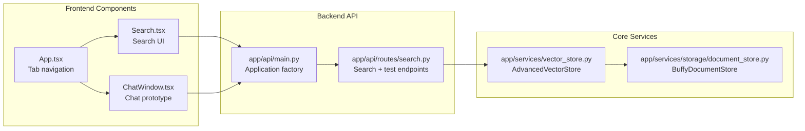
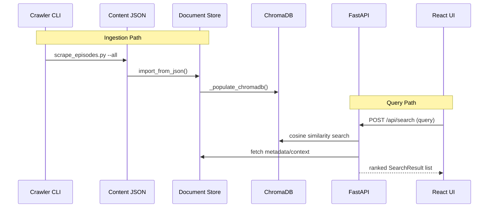

# TV Show Chat – System Architecture

TV Show Chat is a semantic search and chat experience for *Buffy the Vampire Slayer*. The system ingests episode content, stores structured documents, generates embeddings, and serves semantic results to a React frontend via a FastAPI backend.

---

## 1. High-Level Overview

- **Backend:** FastAPI (Python 3.12) with Uvicorn; exposes REST endpoints, orchestrates ingest/search, and manages lifecycle hooks (document store + ChromaDB).
- **Vector Store:** ChromaDB (persistent client) stores episode embeddings; file-based document store (`app/data/episodes`) acts as canonical backup.
- **Embedding Model:** `sentence-transformers/all-MiniLM-L6-v2` loaded lazily for query encoding and on-demand embedding generation.
- **Frontend:** React 18 + TypeScript + Vite; communicates with API for search and diagnostics.
- **Automation:** Shell scripts (`init.sh`, `run.sh`, `test.sh`, `scripts/scrape_episodes.py`) standardize environment setup, testing, and crawling/status checks.

---

## 2. Architecture Diagram

```mermaid
graph TB
    subgraph "Frontend Layer"
        UI[React UI
TypeScript + TailwindCSS]
        SearchComp[Search Component]
        ChatComp[Chat Component]
    end

    subgraph "API Layer"
        FastAPI[FastAPI Server
Port 8000]
        SearchRoute[/api/search]
        HealthRoute[/health/*]
    end

    subgraph "Service Layer"
        VectorStore[AdvancedVectorStore
ChromaDB Client]
        DocumentStore[BuffyDocumentStore
File-backed episodes]
        EmbedService[SentenceTransformer
Embeddings]
    end

    subgraph "Storage Layer"
        Chroma[(ChromaDB
PersistentClient)]
        EpisodeFiles[(Episodes JSON
app/data/episodes)]
        EmbeddingFiles[(Embeddings JSON
app/data/embeddings)]
        ContentFiles[(Raw scrape JSON
app/content)]
    end

    UI --> SearchComp
    UI --> ChatComp
    SearchComp --> FastAPI
    ChatComp --> FastAPI
    FastAPI --> SearchRoute
    FastAPI --> HealthRoute
    SearchRoute --> VectorStore
    VectorStore --> EmbedService
    VectorStore --> DocumentStore
    VectorStore --> Chroma
    DocumentStore --> EpisodeFiles
    DocumentStore --> EmbeddingFiles
    ContentFiles --> DocumentStore
```

---

## 3. Component Architecture



---

## 4. Data Flow



---

## 5. Storage & Pipeline

1. **Content JSON (`app/content/`)** – Aggregated scrape data (`btvs_all_seasons.json`).
2. **Document Store (`app/data/episodes/`)** – Season files derived from latest content; embeddings cached in `app/data/embeddings/`.
3. **ChromaDB (`app/data/chroma/`)** – Persistent vector collection (`buffy_episodes`) populated at startup when empty; reused afterwards.
4. **Health & Monitoring** – `/health/vector-store`, `/health/model`, `/api/test`, and `scripts/scrape_episodes.py --status` provide diagnostics for each layer.

---

## 6. API Overview

| Endpoint | Purpose |
| --- | --- |
| `GET /health` | Application heartbeat |
| `GET /health/vector-store` | Confirms Chroma availability |
| `GET /health/model` | Validates SentenceTransformer load |
| `GET /api/test` | System snapshot (stats + sample) |
| `GET /api/test-search` | Fixture queries for smoke tests |
| `POST /api/search` | Semantic search across episodes |

Responses align with the frontend `SearchResult` interface and include season/episode identifiers, titles, summaries, metadata, and similarity scores.

---

## 7. Operational Scripts

- `init.sh` – creates Python 3.12 venv, installs dependencies, primes data folders.
- `run.sh` – enforces Python 3.12, runs FastAPI via Uvicorn, handles shutdown.
- `run_frontend.sh` – starts Vite dev server.
- `scripts/scrape_episodes.py` – crawler/status CLI (`--status`, `--all`, per-season planned).
- `test.sh` – orchestrates health checks, search tests, crawler status, and pipeline integrity validation.

---

## 8. Scalability & Roadmap

- **Short Term:** Expand crawler to all seven seasons, add reindex helpers, extend pipeline tests, enrich roadmap documentation.
- **Medium Term:** Incremental crawling, automated re-population triggers, richer frontend experience, and optional chat UX.
- **Long Term:** Multi-show support, pluggable vector stores, production deployment with containerization and monitoring.
