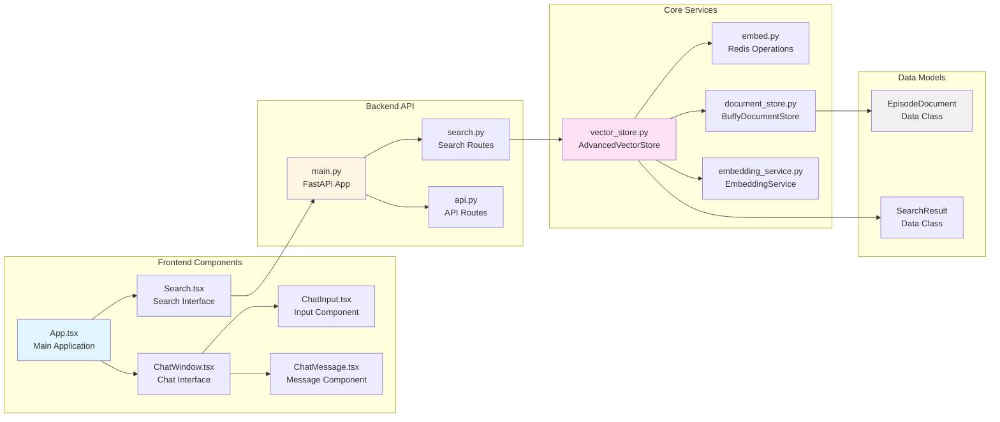
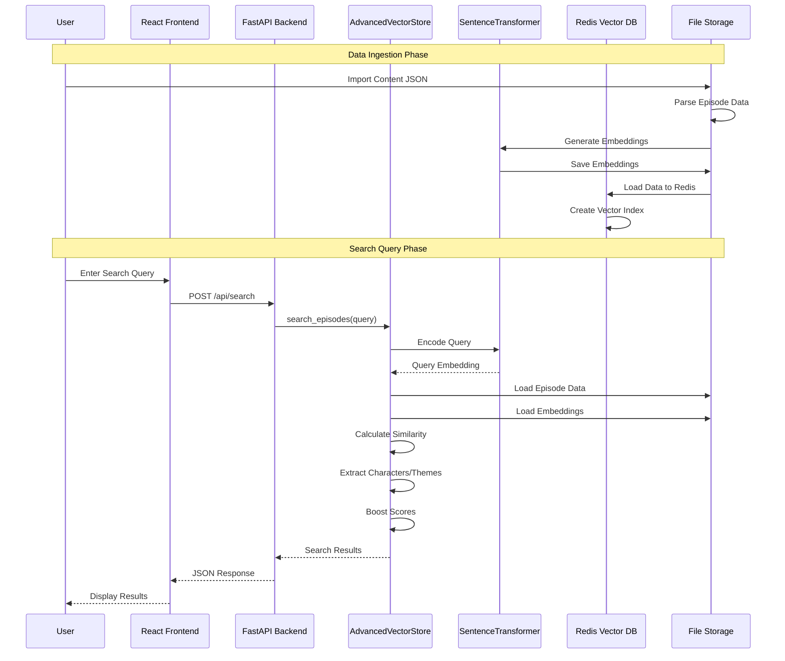
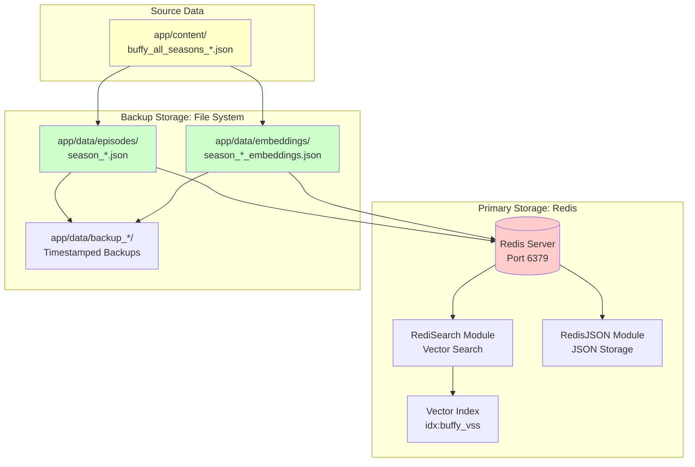
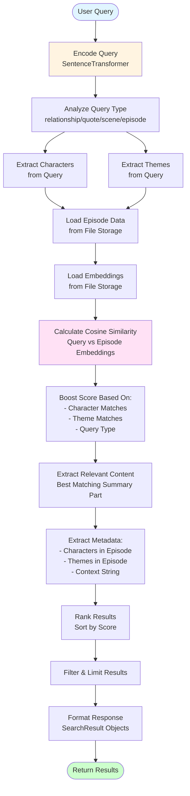
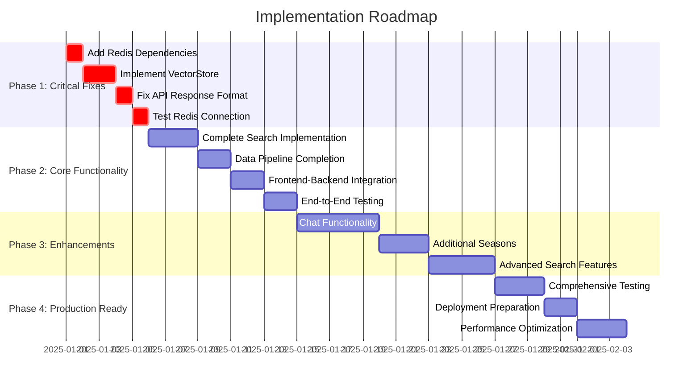
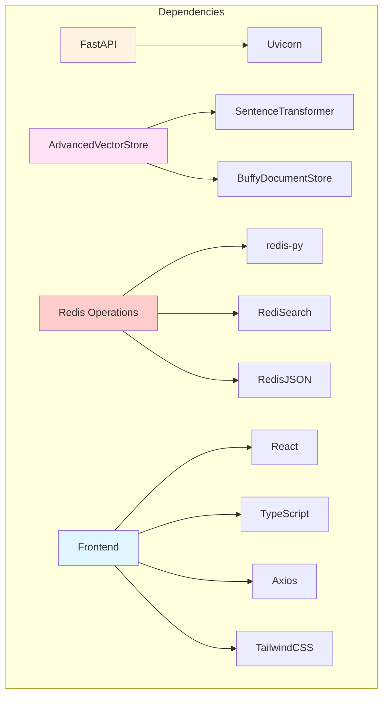
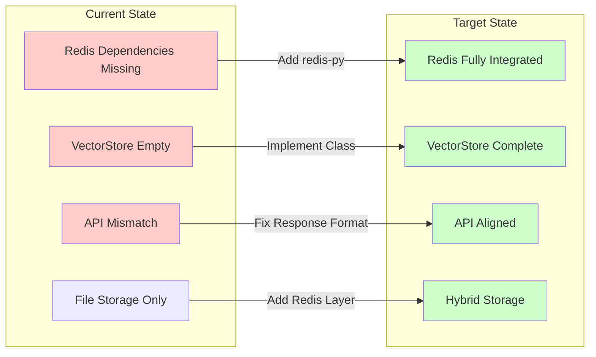
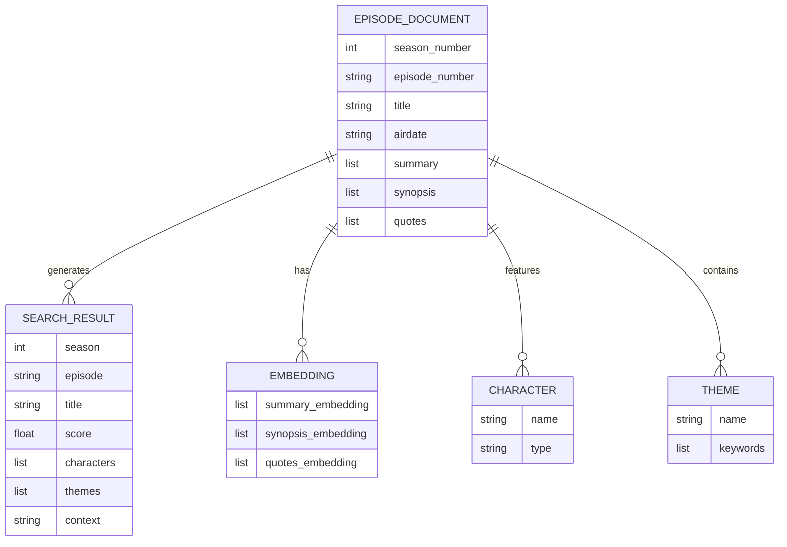

# TV Show Chat - Architecture Diagrams

This document provides comprehensive architecture diagrams using Mermaid.js to visualize the system design, data flow, and implementation planning.

## Table of Contents
1. [System Overview](#system-overview)
2. [Component Architecture](#component-architecture)
3. [Data Flow](#data-flow)
4. [Storage Architecture](#storage-architecture)
5. [Search Pipeline](#search-pipeline)
6. [Implementation Phases](#implementation-phases)

---

## System Overview

```mermaid
graph TB
    subgraph "Frontend Layer"
        UI[React UI<br/>TypeScript + TailwindCSS]
        SearchComp[Search Component]
        ChatComp[Chat Component]
    end
    
    subgraph "API Layer"
        FastAPI[FastAPI Server<br/>Port 8000]
        SearchRoute[/api/search]
        HealthRoute[/health]
        StaticFiles[Static File Server]
    end
    
    subgraph "Service Layer"
        VectorStore[AdvancedVectorStore<br/>Semantic Search Logic]
        EmbeddingService[EmbeddingService<br/>Sentence Transformers]
        DocumentStore[BuffyDocumentStore<br/>File-based Storage]
    end
    
    subgraph "Storage Layer"
        Redis[(Redis<br/>Vector Database<br/>RediSearch + RedisJSON)]
        FileStorage[(File Storage<br/>JSON Files)]
        Embeddings[(Embeddings<br/>JSON Files)]
    end
    
    subgraph "Data Sources"
        ContentFiles[Content JSON Files<br/>buffy_all_seasons_*.json]
    end
    
    UI --> SearchComp
    UI --> ChatComp
    SearchComp --> FastAPI
    ChatComp --> FastAPI
    FastAPI --> SearchRoute
    FastAPI --> HealthRoute
    FastAPI --> StaticFiles
    SearchRoute --> VectorStore
    VectorStore --> EmbeddingService
    VectorStore --> DocumentStore
    VectorStore --> Redis
    DocumentStore --> FileStorage
    DocumentStore --> Embeddings
    EmbeddingService --> Redis
    ContentFiles --> DocumentStore
    
    style UI fill:#e1f5ff
    style FastAPI fill:#fff4e1
    style VectorStore fill:#ffe1f5
    style Redis fill:#ffcccc
    style FileStorage fill:#ccffcc
```

---

## Component Architecture



---

## Data Flow



---

## Storage Architecture



---

## Search Pipeline



---

## Implementation Phases



---

## Component Dependencies



---

## Current State vs Target State



---

## Data Model Relationships



---

## Next Steps

Based on these diagrams, the implementation should follow this order:

1. **Phase 1: Foundation** (Critical Fixes)
   - Add Redis dependencies to requirements.txt
   - Implement VectorStore class properly
   - Fix API response format alignment
   - Test Redis connection

2. **Phase 2: Core Features** (Search Functionality)
   - Complete search implementation
   - Ensure data pipeline works end-to-end
   - Integrate frontend and backend
   - Test complete user flow

3. **Phase 3: Enhancements** (Advanced Features)
   - Add chat functionality
   - Expand to more seasons
   - Add advanced search features

4. **Phase 4: Production** (Polish & Deploy)
   - Comprehensive testing
   - Performance optimization
   - Deployment preparation

